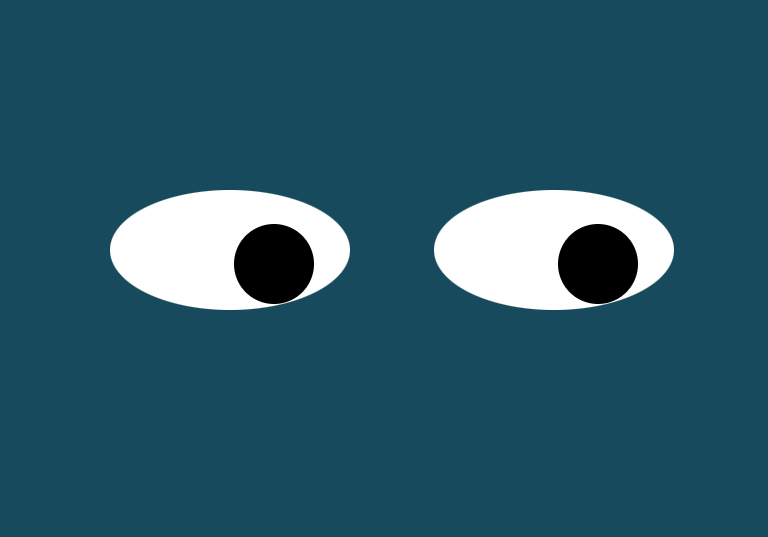

# Eyes Movement

## Description:
We used CSS to draw 2 eyes and their pupils.  We used the 'onmousemove' event in JavaScript to show the pupils following the position of the mouse cursor.  The pupils move relative to the area defined by the outline of the eye.  You can see the center of the pupil reaches the border of the eye when the cursor reaches the edge of the screen.  The eye border is actually a rectangle, with a radiused border to look oval.

## How to Run:
1. Clone Repository to your local environment.
2. Open index.html in a Web Browser. 
3. Click 'Add PacMan' to add PacMen to the screen. 4 Click 'Start Game' to animate the PacMen.

## Roadmap for Future Improvements:
1. Make the eyes cross when the cursor is between them.

## License Information:
MIT License